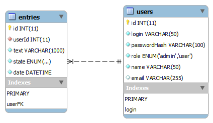

Guestbook Sample
================

This a sample guestbook application with some features.
It's surely incomplete, as it lacks of registration.

Installation
------------

### Apache Virtualhost

You will need to configure you Apache. The simplest way
is to create an VirtualHost entry.
Here is a sample minimal VirtualHost for a server on port 8881.

    Listen 8881
    <VirtualHost *:8881>
        ServerAdmin webmaster@example.com
        DocumentRoot /var/www/guestbook/public

        <Directory /var/www/guestbook/public>
            Options Indexes FollowSymLinks MultiViews
            AllowOverride all
            Order allow,deny
            Allow from all
        </Directory>

    </VirtualHost>

__Important:__ Please point the document root to the public folder. The application
should stay unaccessible.

After an Apache restart, you will find your server on http://localhost:8881/

The project itself has an .htaccess configuration file (public/.htaccess)
and an application configuration file (app/guestbook/config.ini).
You'll have to adjust the base path in both of them.

Per default the application is configured to run under http://yourhost/guestbook

### MySQL

You will find two SQL files in the sql/ directory.
Please import them to your local or remote SQL server.

Maybe you need to adjust the SQL server configuration
in the config file (app/guestbook/config.ini)

This is the schema of the database

### Unit Tests

Please run *composer update* in the project's root folder to get all needed dependencies.
Unit tests are called with

    phpunit -c phpunit.xml

Usage
-----

You get this application without a registration process.
So the first three users are:

* Administrator (Username: admin / Password: admin)
* Hans Wurst (Username: hans / Password: hans)
* John Doe (Username: john / Password: john)

You don't have to write this down as you will see this information
on the login screen again. ;-)

Technical Details
-----------------

The project contains some technical parts, that need an explanation

* __Router__: Takes the URI and matches it against pre-configured routes to get a Resource
* __Resources__: Logical backends of every single page and contains two main HTTP methods 'get' and 'post' to divide actions properly
* __Views__: HTML markup with little templating PHP
* __Session__: Stores values in the PHP internal session store or in memory for testing purposes
* __Auth__: Authenticates users with the help of UserService and stores their data in session stores
* __Database__: Very abstract class that users provided Connectors to communicate with databases
* __Connectors__: Low-level database communicators
* __Entities__: Represent database entries/rows in an OOP manner
* __EntityServices__: Communicate with Connectors and create entities. They provide a mapping method between arrays and objects and vice versa.

All main objects are instantiated at the very top of the application. This is a so-called inversion of control.

The whole structure is made to enable other developers to exchange or add
parts of the application quickly and without big side effects. For example,
it's very easy to add a different database storage engine by creating a new
Connector and adding it to the DatabaseFactory.

Questions
---------

If you have any questions, opinions or other stuff you want to talk about, don't hesitate to bother me!
